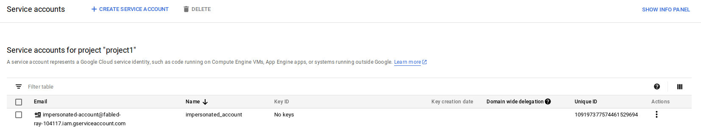

# Extend GCP Service Account Identity and Token Scope on AppEngine and Cloud Functions

The service_account Identity on GAE and Cloud Functions is static at the moment...its always ```YOUR_APPID@appspot.gserviceaccount.com``` What if you needed a different service account andan [oauth2 access_token](https://cloud.google.com/appengine/docs/standard/python/appidentity/#asserting_identity_to_google_apis) that carried different scopes and capabilities? There is no real easy procedure to do this but this article details one approach outlined last year to impersonate another service account on GCP. The approach here basically runs the oauth2 token flow manually using a specific (powerful) GCP IAM capabiltiy: Service Account Token Creator role.

One usecase for that is detailed in the article i’ve referenced earlier which is to perform [GSuites Administration actions from GAE](https://medium.com/@salmaan.rashid/consuming-and-validating-gsuites-audit-push-notification-on-appengine-a98a178ee82e).

You can use IAM Policies on identities (service account identity) to restrict access to GCP resources but what this procedure does is to allow GAE/GCF’s default static service account to assume the identity of another one (which would have access to the resource).

In other words, on GAE/GCF

From:
-  Service Account: ```YOUR_PROJECTID@appspot.gserviceaccount.com```
   -  scope: ```https://www.googleapis.com/auth/cloud-platform```

To:

-  Service Account: ```SOME_OTHER_ACCOUNT@ANY_PROJECT.iam.gserviceaccount.com```
   -  scope: ```https://www.googleapis.com/auth/books```


> Note, although i've described a way to get a token with an alternative scope for _another_service account, you can easily just **self-delegate** provleges from GAE/GCF to itself or even impersonate an account on some _other_ project (i'll describe this later).

One drawback with this procedure is there are several rountrips involved to exchange GAE/GCF's default token for some other service_accounts' identity.
You can potentially mitigate this with saving a token thread_local for the duration of its validity (for GCP access_tokens, its ```3600s``` total lifetime).

---

## Resources

- [Consuming and validating GSuites Audit Push notification on AppEngine](https://github.com/salrashid123/gsuites_appengine_events)
- [Impersonate another service account on GCP](https://medium.com/google-cloud/using-serviceaccountactor-iam-role-for-account-impersonation-on-google-cloud-platform-a9e7118480ed)
- [Google Scopes](https://developers.google.com/identity/protocols/googlescopes)
- [serviceAccounts.signJwt](https://cloud.google.com/iam/reference/rest/v1/projects.serviceAccounts/signJwt)
- [Service Account Oauth flow](https://developers.google.com/identity/protocols/OAuth2ServiceAccount#authorizingrequests)
- [Service Account Token Creator Role](https://cloud.google.com/iam/docs/understanding-roles#service_account_roles)


## Implemenation

The attached code here allows you to deploy either a GAE Standard Python applicaiton or Google Cloud Funcitons node.js app that performs the steps detailed in the links above (specifically [this one](https://medium.com/google-cloud/using-serviceaccountactor-iam-role-for-account-impersonation-on-google-cloud-platform-a9e7118480ed) )

ust to be clear, you can at anytime (without this procedure), request a GAE/GCF for an access_token with your own scopes easily as shown below

```python
EXTRA_SCOPES = [
'https://www.googleapis.com/auth/books',
'https://www.googleapis.com/auth/admin.reports.usage.readonly'
]

credentials = GoogleCredentials.get_application_default()     credentials = credentials.create_scoped(EXTRA_SCOPES)
```

but what you can’t do is change to identity or ask for additional claims (i.,e [.create_delegated()](http://oauth2client.readthedocs.io/en/latest/source/oauth2client.service_account.html#oauth2client.service_account.ServiceAccountCredentials.create_delegated))

You will also find the issued_to and audience of the default GAE/GCF tokens are set to ```anonymous``

```json
{  
  "issued_to": "anonymous",  
  "audience": "anonymous",  
  "scope": "https://www.googleapis.com/auth/books",  
  "expires_in": 2263,  
  "access_type": "offline" 
}
```


Admittedly, the code isn't pretty (I barely know nodejs) but it does work (i'll gladly take pull requests to fix anything...i just felt its more important
to go through the steps in excruciating(!) detail.)

What you'll need is to have a GCP project (yes) to create a new service account on the Cloud console.

The new service account you will need to create _does not even need a private key_!!   THis is because GAE and GCF will automatically use its internal key
set to sign.

For now, just go to the cloud console (really, for any project) and just create a service_account.

Now, lets setup the rest of the steps.

### Assign Service Account Token Creator Permission to GAE/GCF

THis step is critical: in order for GAE/GCF to impersonate this new service_account, you need to grant a specific IAM role and permission to it (i.,e this new service account is now a _resource_  and GAE/GCF's service account is an _identity_).  In other words, you're saying "allow GAE/GCF's identity
to sign a JWT on this new service account's behalf).

I used one single project and in that, the permission set looks like this:

> 

My GAE's service account is: ```fabled-ray-104117@appspot.gserviceaccount.com``` and it has been granted a permission of ```Service Account Token Creator```
to ```impersonated-account@fabled-ray-104117.iam.gserviceaccount.com```

Once that step is done,  you can proceed to configure and deploy  the GAE/GCF app.

What those apps will do is impersonate ```impersonated-account@fabled-ray-104117.iam.gserviceaccount.com``` and then use its access_token to query the ```tokeninfo``` API endpoint.  THe response from that endpoint describes the details of the token (i.,e who its for, what are its scopes, etc)

### GAE

I've hardcoded the the service account _to_ impersonate and the SCOPES the token issued.

What you'll want to do is edit [gae/default.py](gae/default.py) and change the ```IMPERSONATED_SVC_ACCOUNT``` value.

change
```
EXTRA_SCOPES = 'https://www.googleapis.com/auth/books https://www.googleapis.com/auth/userinfo.email'
IMPERSONATED_SVC_ACCOUNT = 'impersonated-account@fabled-ray-104117.iam.gserviceaccount.com'
```

then
```
cd gae/
pip install -t lib -r requirements.txt

gcloud app deploy app.yaml --version imp  -q --no-promote
```

access the app at ```https://imp-dot-YOUR_PROJECT_ID.appspot.com/```


you should see an output like this:

```json
{
    "access_type": "offline", 
    "audience": "109197377574461529694", 
    "email": "impersonated-account@fabled-ray-104117.iam.gserviceaccount.com", 
    "expires_in": 3600, 
    "issued_to": "109197377574461529694", 
    "scope": "https://www.googleapis.com/auth/userinfo.email https://www.googleapis.com/auth/books", 
    "verified_email": true
}
```

Which is just the output of the tokeninfo endpoint…it just shows details of an access_token.   So, what does the above show?  well, the token is for impersonated-account@fabled-ray-104117.iam.gserviceaccount.com and has scopes that include https://www.googleapis.com/auth/books 
“109197377574461529694” is the UniqueID (clientID) of the service account which you can see in the cloud console too:




The code attached just calls the tokeninfo enpoint raw and passes the token directly.  For a better idomatic experience, you can make use of GCP libraries that allow you to specify the token and have a ```credential``` object to use.  For more info see [AccessTokenCredentials](http://oauth2client.readthedocs.io/en/latest/source/oauth2client.client.html#oauth2client.client.AccessTokenCredentials)


### GCF

To deploy on GCF, again edit [gcf/index.js](gcf/index.js) file and change the ```IMPERSONATED_SVC_ACCOUNT``` value.

```
const IMPERSONATED_SVC_ACCOUNT = 'impersonated-account@fabled-ray-104117.iam.gserviceaccount.com';
const EXTRA_SCOPES = 'https://www.googleapis.com/auth/books https://www.googleapis.com/auth/userinfo.email';
```

then create a temp bucket for the GCF deployment, acquire the libraries and deploy as normal
```
gsutil mb <unique_bucket_name>

cd gcf/
npm i


gcloud beta functions deploy imp --stage-bucket <unique_bucket_name> --trigger-http
```

The output should be something like

```json
{
   "issued_to":"109197377574461529694",
   "audience":"109197377574461529694",
   "scope":"https://www.googleapis.com/auth/userinfo.email https://www.googleapis.com/auth/books",
   "expires_in":3600,
   "email":"impersonated-account@fabled-ray-104117.iam.gserviceaccount.com",
   "verified_email":true,
   "access_type":"offline"
}
```

To repeat the statement from above, code attached just calls the tokeninfo enpoint raw and passes the token directly.  For a better idomatic experience, you can make use of GCP libraries that allow you to specify the token and have a ```credential``` object to use.  For more info see the ```token``` construct here: [service](https://github.com/googleapis/nodejs-common/blob/master/src/service.ts#L53)

## Conclusion

Hope this procedure sheds some light on the service account GAE/GCF uses and how you can (for now atleast) overcome the idenity
and scope limiations.   As mentioned, this involves an extra rountrip to acqurie the access_tokens that you can't normally get on GCF.
One usecase for that is detailed in the article i've referenced earlier which is to perform GSuites actions from GAE or GF.

Any corrections or improvements welcome!


